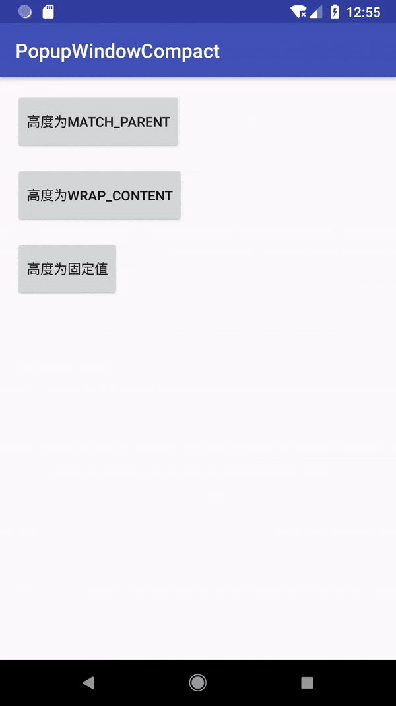

# PopupWindowCompat
[](https://travis-ci.com/wang0826jj/PopupWindowCompat) [](https://bintray.com/wang0826jj/maven/PopupWindowCompat/_latestVersion) [](https://github.com/wang0826jj/PopupWindowCompat/blob/master/LICENSE)

## [English](README_EN.md) | 中文

一个兼容android 7.x , 8.x etc系统的Popwindow，主要适配当设置高度为match_parent时，调用`popupWindow.showAsDropDown()`后的高度全屏问题，同时适配了是否有虚拟按键，虚拟按键是否显示的情况。

## 添加到项目

```groovy
implementation 'com.jankin.popupwindowcompat:lib:1.0.4'
```

## 使用

使用PopupWindowCompat替代PopupWindow，用法和PopupWindow一样。

## 效果图




## 传送门

- [博客文章](https://blog.csdn.net/Kelaker/article/details/81274417)